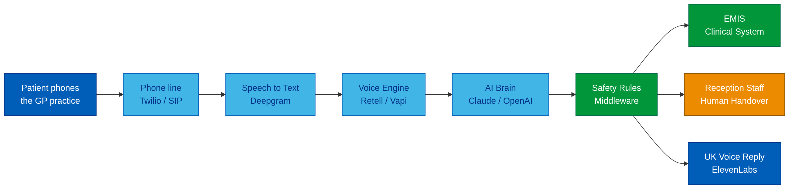
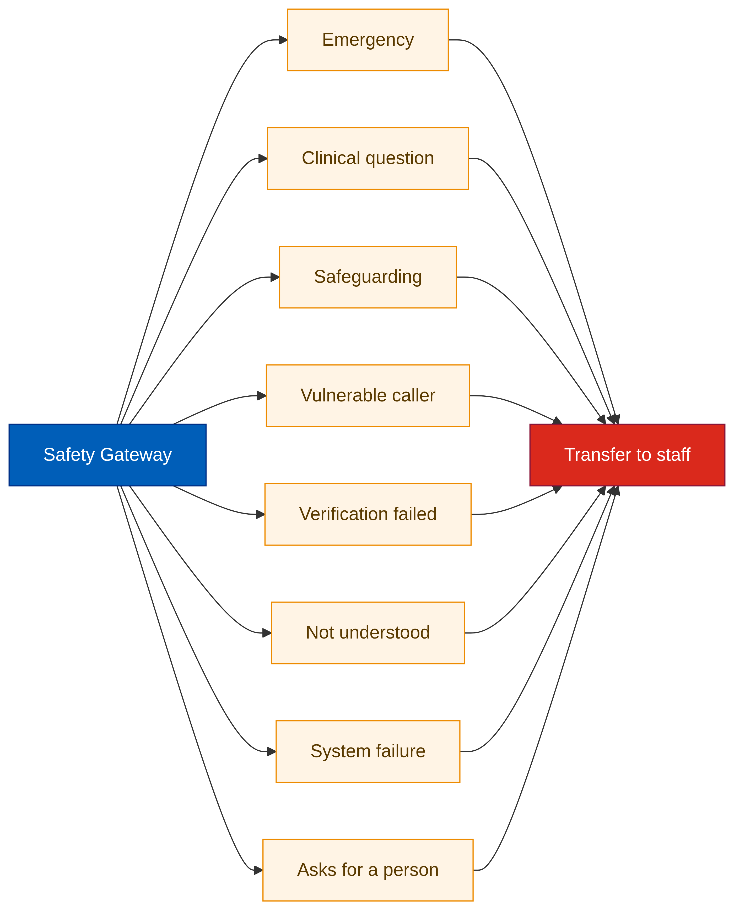
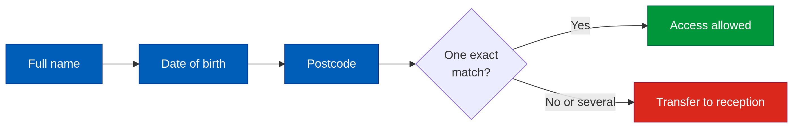
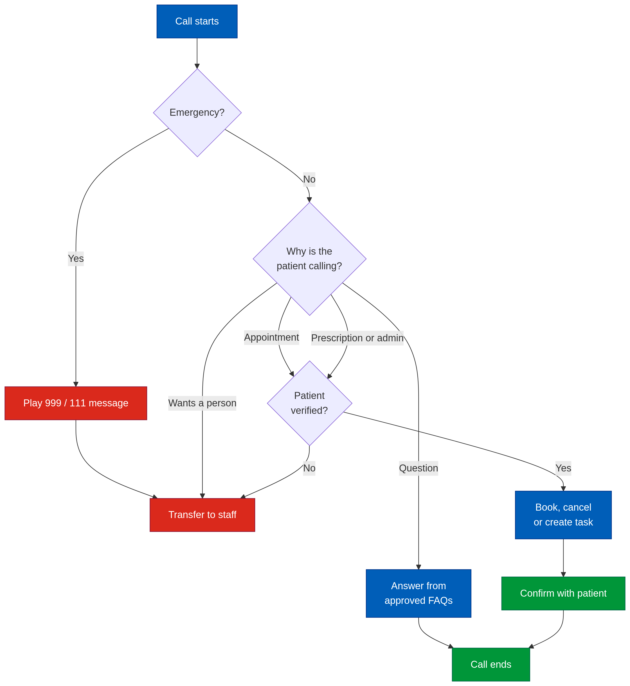
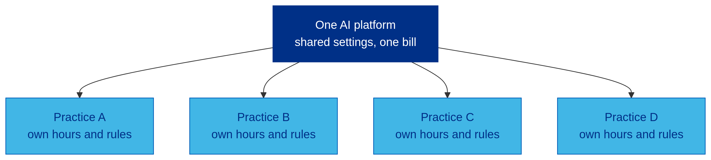

# AI Receptionist and Voice Agent for NHS GP Practices (2026)

### A ready-to-deploy AI phone system for UK GP surgeries. It answers patient calls, books appointments in EMIS and hands the call to a person whenever it should.

 &nbsp;**Built for the United Kingdom** &nbsp;|&nbsp; **Priced in GBP (£)** &nbsp;|&nbsp; **Live demo available**

## In Short

**The NHS GP AI Voice Agent is an AI receptionist for UK GP practices.** It answers the phone in a natural British voice. It books, cancels and changes appointments directly in EMIS, and handles prescription and admin requests. Emergencies, clinical questions and anyone who asks for a person always go to reception staff. One system serves several practices, which suits PCNs and GP federations. It was designed and built by **Tanveer Hussain**, an AI voice agent engineer, and costs **from £6,500** for four practices (or **£199 a month per practice** with no big upfront cost), with a typical payback of **about 3 months**. **The practice owns the system**: no lock-in and no marked-up call fees.

**The system is built and ready.** Ask for a live demo and hear it take a real patient call journey.

## Key Facts

| | |
|---|---|
| **What it is** | AI receptionist / AI voice agent for GP surgeries |
| **Year** | 2026 to 2027 |
| **Status** | Built and ready to deploy. Live demo on request |
| **Country** |  United Kingdom (England, Scotland, Wales, Northern Ireland) |
| **Works with** | EMIS Web (through Asteroid AI or GP Connect); SystmOne and others where API access is approved |
| **Answers calls** | 24 hours a day, 7 days a week |
| **Response speed** | About 1 to 1.5 seconds, like a normal phone call |
| **Price** | From **£6,500** for four practices, or £199 a month per practice ([pricing](#how-much-does-it-cost)) |
| **Ownership** | You own the system and your data. No lock-in |
| **Savings** | About 2 receptionists' worth of phone time across four practices ([savings](#how-much-money-does-it-save)) |
| **Code** | Private, delivered to clients under contract |

## What Problem Does It Solve?

- **The 8am rush.** Patients wait on hold for a long time or give up.
- **Tired reception teams.** Staff spend their day on the same routine calls.
- **Phone menus that do nothing.** "Press 1 for…" cannot book or cancel anything.
- **Missed appointments.** Patients who cannot get through do not cancel, so slots are wasted.

The AI receptionist takes the routine calls. Your staff keep the calls that need a person.

 

## How Does It Work?

It works in three simple steps:

1. **The patient calls your normal practice number.** The AI answers straight away in a friendly British voice.
2. **The AI understands the request and checks who is calling.** For bookings, it confirms the patient's name, date of birth and postcode.
3. **It completes the task, or passes the call to your team.** It books or cancels the appointment in EMIS, creates a task for staff, or transfers the call.

**Main design rule:** the AI only understands and talks. **Fixed safety rules decide** what it is allowed to do. It can never act outside the rules your practice approves.

## What Can It Do?

| Feature | What it does |
|---|---|
| **24/7 call answering** | Natural UK voice; patients can interrupt it, like talking to a person |
| **Understands the reason for the call** | Also copes when a caller changes their mind mid-call |
| **Patient verification** | Name, date of birth, postcode and NHS number |
| **Appointment booking** | Checks EMIS availability and books the slot |
| **Cancel and reschedule** | Changes existing appointments |
| **Prescriptions and admin** | Creates structured tasks for staff |
| **Practice information** | Opening hours, location and services |
| **Safe handover** | Transfers to a person whenever a rule says so |
| **Manager dashboard** | Call numbers, reasons, outcomes and savings |

> The AI **never diagnoses** and **never makes clinical decisions**.

## How Much Money Does It Save?

### Example: four NHS GP practices

| Item | Estimate |
|---|---|
| Calls per practice per day | 200 |
| Calls handled fully by the AI | 40% (80 calls per practice) |
| Average call length | 3 minutes |
| Staff phone time saved | About 16 hours a day, or about **2 full-time receptionists** |
| Value of staff time saved | About **£60,000 a year** |
| AI running costs (phone line, voice, AI) | About £29,000 a year |
| Monthly support | £4,200 a year |
| **Net saving** | **About £26,000 a year** |
| **One-time cost** | **£6,500** |
| **Payback** | **About 3 months** |

**There is extra value on top of this.** Patients can cancel easily at any hour, so each practice gets back about 10 slots a week. Across four practices that is about **2,000 GP appointments a year** that other patients can use.

### Example: a private clinic (private GP, dental, physio, aesthetics)

| Item | Estimate |
|---|---|
| Missed calls per day | 10 |
| Missed calls that would have booked | 30% (3 bookings a day) |
| Average booking value | £120 |
| **Extra revenue recovered** | **About £360 a day, or about £88,000 a year** |

### What changes after go-live

| | Before | After |
|---|---|---|
| **8am queue** | Long hold times, callers giving up | Many calls answered at once |
| **Reception team** | Answering every routine call | Free for complex and in-person patients |
| **Evenings and weekends** | Voicemail | Cancellations, questions and callback requests handled |
| **Management** | No call data | Dashboard of call demand and outcomes |

> These are illustrative estimates. Your numbers depend on call volume, staff costs and which calls you automate. The Discovery stage produces a business case from your practice's real call data.

## How Does It Compare?

| Option | Answers at 8am rush | Books in EMIS | Works 24/7 | Yearly cost (4 practices) |
|---|---|---|---|---|
| **AI voice agent (this system)** | Yes, many calls at once | Yes | Yes | About £33,000 running + £6,500 once |
| Hiring 2 more receptionists | Partly | Yes | No | About £60,000 |
| Phone menu (IVR) | No, queues remain | No | Messages only | Low, but no calls resolved |
| Callback queue | Reduces hold time only | No | No | Low, but staff still take every call |

## Why Choose This Over a Subscription AI Receptionist?

| | This system | Typical subscription product |
|---|---|---|
| **Ownership** | You own the system, scripts and data | You rent it; leaving means starting again |
| **Call costs** | Paid to the providers at cost | Often bundled with a markup |
| **Your rules** | Built around your practice's exact workflows | Fixed product features |
| **Branding** | Can run under your own name (white-label) | The vendor's brand |
| **Languages** | Can be set up for Urdu, Punjabi, Bengali, Polish and more for local communities | Depends on the product |
| **Direct access** | You speak to the engineer who built it | Support ticket queue |

**Also a good fit for health tech and telephony companies** that want their own branded AI voice agent built for them.

## How Much Does It Cost?

 All prices are in **British pounds (GBP)**.

| Package | What you get | Timeline | Price |
|---|---|---|---|
| **Live Demo** | See and hear the AI take real call journeys | 30 minutes | **Free** |
| **Discovery** | Call-journey mapping, EMIS check, security review, business case, go-live plan | 1 week | **£500** |

**Option A: Build and Own** (you own the system; pay the AI providers directly, at cost)

| Package | What you get | Timeline | Price |
|---|---|---|---|
| **Single Practice** | AI receptionist for one practice: FAQs, appointments, EMIS, safety rules, testing | 2 to 3 weeks | **£2,500** |
| **Complete System: Four Practices** | All practices, verification, escalation, prescriptions and admin, manager dashboard, pilot, rollout and staff guide | 6 to 8 weeks | **£6,500** |
| **Monthly Support** | Monitoring, fixes, script and rule updates, monthly report | Ongoing | **£350 / month** |

**Option B: Managed Monthly Plan** (no big upfront cost; I run everything for you)

| Package | What you get | Price |
|---|---|---|
| **Setup** | Configuration for your practice, EMIS connection, testing | **£750 per practice, one time** |
| **Monthly plan** | Hosting, monitoring, updates, support and monthly report | **£199 / month per practice** |

- The Discovery fee is taken off the build price if you continue.
- You can start on Option B and move to Option A later.
- Running costs (phone line, voice and AI usage) are paid directly to the providers, usually about 10p to 15p per call minute.
- The final price is confirmed after Discovery.

## Is It Safe and NHS Compliant?

It is designed for NHS rules from the start:

| Area | How it is covered |
|---|---|
| **Patient safety** | Emergencies get the approved 999 / NHS 111 message and go straight to staff. No medical advice is given |
| **Data protection** | UK GDPR, NHS information governance, only the minimum data is collected |
| **Security** | Encryption, secure passwords and keys, audit logs, role-based access |
| **Assurance** | Supports your DPIA, DSPT and DCB0129 / DCB0160 clinical safety work |

**Patient check before any personal information is shared:**

## What Happens on a Call?

## Can One System Serve Several Practices?

Yes. One platform serves every practice, and each practice keeps its own phone numbers, opening hours, appointment types, handover rules and FAQs. Changes are made in the settings, **without rebuilding anything**.

## Who Is It For?

| Sector | Organisations |
|---|---|
| **NHS Primary Care** | GP practices, Primary Care Networks (PCNs), GP federations, Integrated Care Boards (ICBs), out-of-hours hubs, health centres |
| **NHS Services** | Hospital outpatients, community services, NHS dental practices, community pharmacies |
| **Private Healthcare** | Private GP clinics, private hospitals, dental groups, opticians, physiotherapy, dermatology, fertility and diagnostic centres, occupational health |
| **Other Clinics** | Veterinary practices, care homes, home-care providers |
| **Health Tech** | Healthcare software companies, GP telephony providers, digital health start-ups |

## Manager Dashboard

It shows call volume, calls handled by the AI, transfers to staff, bookings and cancellations, reasons for calling, average call time and system errors.

## How Do I Get It?

1. **Book a free live demo.** Hear the AI take a real call journey.
2. **Discovery.** We map your calls and confirm your EMIS access.
3. **Setup.** Your hours, rules, FAQs and voice are configured.
4. **Pilot.** One practice goes live and is monitored daily.
5. **Go live.** The remaining practices are switched on.

Technical details for IT teams: [Architecture](docs/architecture.md) | [Delivery Process](docs/delivery-process.md)

## Book a Live Demo

**The system is built and ready. Ask for a demo and see it working before you decide.**

| How to book | Link |
|---|---|
| **WhatsApp (fastest)** | [Book a demo on WhatsApp](https://wa.me/923433348566?text=Hi%20Tanveer%2C%20I%20would%20like%20a%20live%20demo%20of%20the%20AI%20receptionist%20for%20GP%20practices.) |
| **Upwork** | [Message me on Upwork](https://www.upwork.com/freelancers/~01a14d825a9bd8689d) |
| **LinkedIn** | [Message me on LinkedIn](https://www.linkedin.com/in/tanveer-hussain-277119196/) |

**Free 72-hour review:** tell me how your practice handles calls today. Within 72 hours you get a plan, a cost estimate and the expected savings.

## Frequently Asked Questions

**What is an AI receptionist for a GP practice?**
It is an AI phone assistant that answers patient calls, books and cancels appointments, answers common questions and passes other calls to reception staff.

**Can AI answer the phones at my GP surgery?**
Yes. This system answers calls 24/7 on your existing practice number in a natural UK voice.

**How much does an AI receptionist cost in the UK?**
You can buy and own it from £2,500 for one practice or £6,500 for four practices, or use the managed plan at £750 setup plus £199 a month per practice. Running costs are about 10p to 15p per call minute, paid to the providers at cost. [See pricing](#how-much-does-it-cost).

**Can an AI voice agent book GP appointments in EMIS?**
Yes, through approved API access such as Asteroid AI or GP Connect.

**Is an AI receptionist safe for NHS patients?**
Yes, when it is built with fixed safety rules. It gives no medical advice, emergencies go straight to staff, and patients are verified before any personal information is shared.

**Will patients know they are talking to an AI?**
Yes. It says so at the start of the call, and patients can ask for a person at any time.

**Does it understand UK accents and elderly callers?**
Yes. It uses speech recognition tuned for UK phone calls and speaks at a calm, adjustable pace.

**How long does it take to set up?**
2 to 3 weeks for one practice, and 6 to 8 weeks for four practices.

**Why build my own instead of subscribing to an AI receptionist?**
You own the system and your data, pay AI providers at cost with no markup, and get rules built around your practice. If you prefer not to pay upfront, the managed plan starts at £199 a month per practice.

**Who builds AI voice agents for GP practices?**
This system was built by Tanveer Hussain, an AI voice agent and automation engineer. He is Top Rated on Upwork with a 100% Job Success score. [Contact details](#contact).

## Contact

**Tanveer Hussain**, AI Voice Agent and Automation Engineer
Top Rated on Upwork | 100% Job Success | ElevenLabs specialist | 100+ projects delivered

| Channel | Link |
|---|---|
|  **Upwork** | [Hire me on Upwork](https://www.upwork.com/freelancers/~01a14d825a9bd8689d) |
| **LinkedIn** | [Tanveer Hussain on LinkedIn](https://www.linkedin.com/in/tanveer-hussain-277119196/) |
|  **WhatsApp** | [+92 343 3348566](https://wa.me/923433348566) |

## Tech Stack

&nbsp;&nbsp;
&nbsp;&nbsp;
&nbsp;&nbsp;
&nbsp;&nbsp;
&nbsp;&nbsp;
&nbsp;&nbsp;
&nbsp;&nbsp;
&nbsp;&nbsp;

Also used: Twilio, Retell AI, Vapi and OpenAI.

## Thank You

Thank you for reading. If this could help your practice or organisation, book a live demo or send a message on any channel above.

If you found this useful, please give the repository a **star** so other practices can find it.

This is an independent project. It is not affiliated with NHS England, EMIS / Optum, TPP or Asteroid AI. Trademarks belong to their owners. It is an administrative tool, not a medical device. Photos from [Unsplash](https://unsplash.com) (Vitaly Gariev) under the Unsplash License. Logos from [Simple Icons](https://simpleicons.org). Flag from [Flagpedia](https://flagpedia.net).

Keywords: AI receptionist for GP practice UK, AI receptionist UK 2026, AI voice agent NHS, GP surgery phone answering AI, AI phone system for doctors UK, EMIS integration, EMIS Web API, GP Connect, NHS telephony AI, AI appointment booking UK, reduce 8am GP rush, PCN digital transformation, ICB access recovery, AI receptionist cost UK, AI receptionist ROI, dental receptionist AI UK, private clinic AI receptionist, healthcare voice AI UK, Retell AI, Vapi, ElevenLabs UK voice, Deepgram, Twilio, n8n healthcare automation, UK GDPR, DSPT, DCB0129
