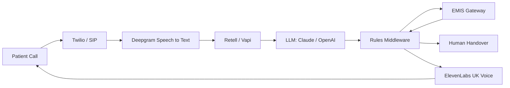
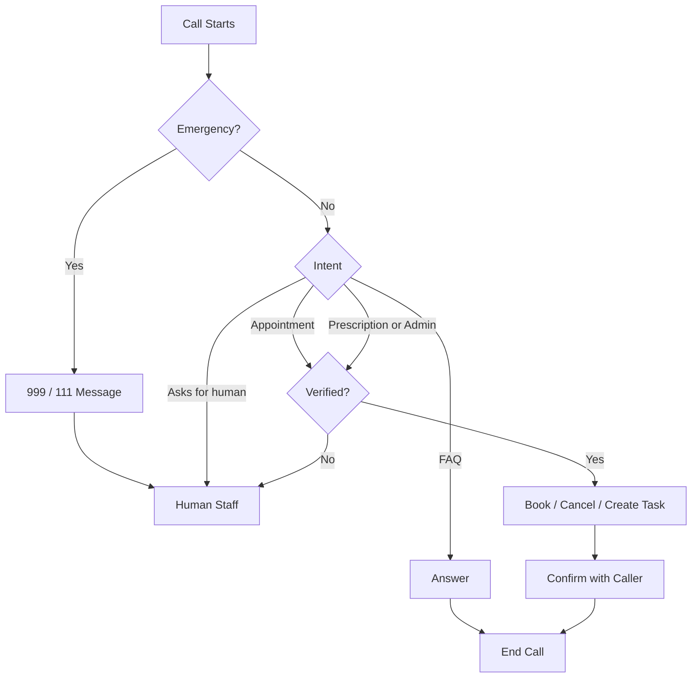
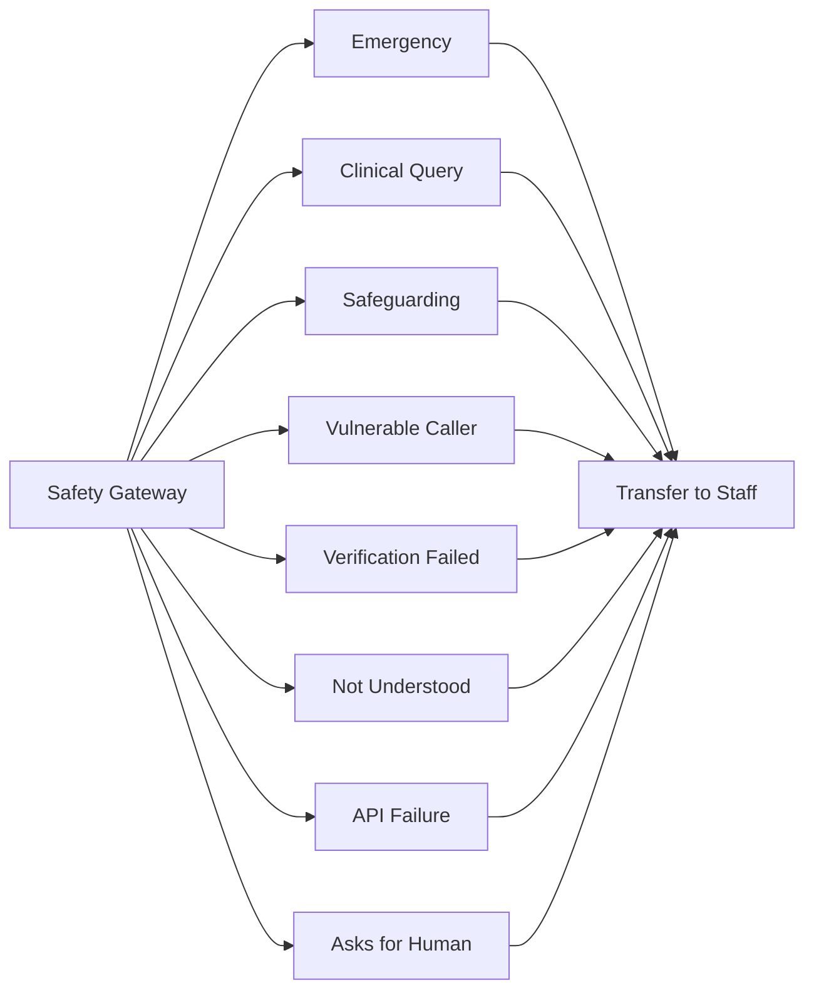
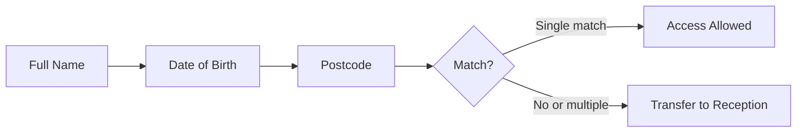
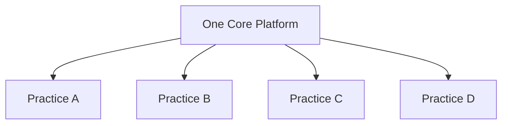
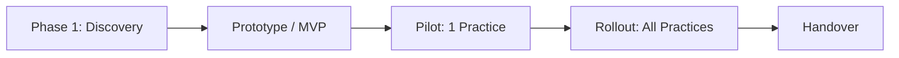

# AI Voice Agent for NHS GP Practices with EMIS Integration (2026)

### AI receptionist for UK GP surgeries that answers patient calls, books appointments in EMIS and escalates safely to humans

## Project Overview

| | |
|---|---|
| **Project** | AI Voice Agent for NHS GP Practices |
| **Year** | 2026 to 2027 |
| **Status** | Architecture complete, available for deployment |
| **Market** | United Kingdom: NHS primary care and private healthcare |
| **Clinical system** | EMIS Web (through Asteroid AI or GP Connect) |
| **Scale** | One platform serving many GP surgeries |
| **Latency target** | About 1 to 1.5 seconds per response |
| **Price** | From **$14,500** for the complete four-practice system ([see pricing](#pricing)) |
| **Business result** | About 2 staff FTE of phone time freed across four practices, with an estimated payback of 5 to 6 months ([see ROI](#business-results-and-roi-in-2026)) |
| **Code** | Private repository, delivered to clients under contract |

> This repository holds the public documentation. The source code and n8n workflows are private. **[Request a demo](#request-a-demo)** to see the system working.

## The Problem

- The 8am rush means long patient queues
- Reception staff are overloaded with routine calls
- Old phone menus frustrate patients and cannot book anything

The voice agent takes these routine calls. Reception staff keep the calls that need a person.

 

## The Solution

| Feature | What it does |
|---|---|
| **24/7 call answering** | Natural UK voice; the caller can interrupt, and the agent takes turns like a person |
| **Intent detection** | Understands why the patient is calling |
| **Patient verification** | Name, date of birth, postcode and NHS number |
| **Appointment booking** | Checks EMIS availability and books the slot |
| **Cancel and reschedule** | Changes existing appointments |
| **Prescriptions and admin** | Creates structured tasks for staff |
| **Practice FAQs** | Opening hours, location, services |
| **Safe escalation** | Hands the call to a human whenever a rule says so |
| **Admin dashboard** | Call analytics and outcomes |

> The AI **never diagnoses** and **never makes clinical decisions**.

## Business Results and ROI in 2026

### What changes for the practice

| Result | Before | After the AI voice agent |
|---|---|---|
| **8am call queue** | Patients wait on hold or hang up | Many calls are answered at once, with no queue |
| **Reception workload** | Staff answer every routine call | Routine calls are automated; staff handle the complex ones |
| **Out-of-hours calls** | Voicemail or a closed line | Cancellations, FAQs and callback requests handled 24/7 |
| **Missed appointments (DNAs)** | Cancelling is hard, so slots are wasted | Easy cancellation by phone frees slots for other patients |
| **Patient experience** | Frustration and complaints | Fast answers in a natural UK voice |
| **Management visibility** | No call data | A dashboard showing call reasons, outcomes and demand |

### How the practice saves money (example: four GP practices)

| Item | Estimate |
|---|---|
| Calls per practice per day | 200 |
| Calls fully automated | 40% (80 calls per practice) |
| Average call length | 3 minutes |
| Staff phone time saved | About 16 hours per day across four practices, about **2 full-time staff** |
| Value of staff time saved | About **$76,000 per year** (UK receptionist cost including on-costs) |
| AI running costs (telephony, voice, LLM) | About $36,000 per year |
| Monthly support | $7,200 per year |
| **Net saving** | **About $33,000 per year** |
| **One-time build** | **$14,500** |
| **Payback period** | **About 5 to 6 months** |

This table does not count **recovered appointment capacity**. If each practice rebooks 10 extra cancelled slots a week because patients can cancel easily, that is about 2,000 GP appointments a year returned to patients across four practices.

### How private clinics earn more money

For private GP, dental, physiotherapy and aesthetics clinics, every missed call can be a lost booking.

| Item | Example |
|---|---|
| Missed calls per day | 10 |
| Missed calls that would have booked | 30% (3 bookings per day) |
| Average booking value | $150 |
| **Extra revenue recovered** | **About $450 per day, about $110,000 per year** |

> These are illustrative estimates. Your results depend on call volume, which journeys are automated, staff costs and provider pricing. Phase 1 Discovery produces a business case based on your practice's real call data.

## System Architecture

**Main design rule:** the LLM understands the caller and drafts replies. **Deterministic code decides** whether an action is permitted.

## Call Flow

## Safety and Escalation Rules

## Patient Verification

## Low Latency (about 1 to 1.5 seconds)

- Streaming speech-to-text
- Fast LLM with short prompts
- Streaming text-to-speech
- A short filler line ("Let me check that for you") while EMIS responds
- Cached FAQs and practice configuration
- Hosting in the UK region

> In previous voice AI work I cut response time from **12s to 1.8s** on a live 24/7 system.

## Multi-Practice Setup

Each practice has its own phone numbers, opening hours, appointment types, escalation rules, FAQs and EMIS settings. Changes are made in the configuration **without rebuilding the agent**.

## Organisations That Can Use This System

| Sector | Organisations |
|---|---|
| **NHS Primary Care** | GP practices, Primary Care Networks (PCNs), GP federations, Integrated Care Boards (ICBs), out-of-hours hubs, health centres |
| **NHS Services** | Hospital outpatients, community services, NHS dental practices, community pharmacies |
| **Private Healthcare** | Private GP clinics, private hospitals, dental groups, opticians, physiotherapy, dermatology, fertility and diagnostic centres, occupational health |
| **Other Clinics** | Veterinary practices, care homes, domiciliary care |
| **Health Tech** | Healthcare software companies, GP telephony providers, digital health start-ups |

The integration layer is modular, so it also fits **SystmOne (TPP)**, **GP Connect** and **Cegedim Vision** where approved API access exists.

## Admin Dashboard

Call volume, automated calls, transfers to staff, failed calls, average call duration, bookings and cancellations, API errors and escalation reasons.

## Security and Compliance

| Area | Covered |
|---|---|
| Data protection | UK GDPR, NHS information governance, data minimisation |
| Protection | Encryption in transit and at rest, secrets management |
| Control | Audit logs, role-based access, data retention rules |
| Assurance | Supports DPIA, DSPT and DCB0129 / DCB0160 work |

## Tech Stack

&nbsp;&nbsp;
&nbsp;&nbsp;
&nbsp;&nbsp;
&nbsp;&nbsp;
&nbsp;&nbsp;
&nbsp;&nbsp;
&nbsp;&nbsp;
&nbsp;&nbsp;

Also used: Twilio, Retell AI, Vapi, OpenAI.

## Delivery Roadmap

Details: [Architecture](docs/architecture.md) and [Delivery Process](docs/delivery-process.md)

## Pricing

| Package | What you get | Timeline | Price (USD) |
|---|---|---|---|
| **Discovery and Scoping** | Call-journey mapping, EMIS / Asteroid assessment, architecture, security review, MVP plan, risk register | 1 to 2 weeks | **$1,500** |
| **MVP: Single Practice** | Voice agent for FAQs and appointments, EMIS integration, safety rules, testing | 3 to 4 weeks | **$6,500** |
| **Complete Project: Four Practices** | Full system for all practices, verification, escalation, prescriptions and admin, admin dashboard, pilot, rollout, runbooks and handover | 8 to 10 weeks | **$14,500** |
| **Monthly Support** | Monitoring, fixes, script and rule updates, performance reports | Ongoing | **$600 / month** |

**Notes**
- The Discovery fee is deducted from the Complete Project price if you continue.
- Third-party running costs (telephony, speech, voice, LLM and integration gateway fees) are billed directly by the providers. Voice AI running costs are typically around $0.10 to $0.20 per call minute.
- Final pricing is confirmed after Discovery, based on the number of practices and the journeys to automate.

## Request a Demo

See the AI voice agent handle a real call journey: booking, cancelling, verifying a patient and escalating to a human.

| How to request | Link |
|---|---|
| **WhatsApp (fastest)** | [Request a demo on WhatsApp](https://wa.me/923433348566?text=Hi%20Tanveer%2C%20I%20would%20like%20a%20demo%20of%20the%20NHS%20GP%20AI%20Voice%20Agent.) |
| **Upwork** | [Message me on Upwork](https://www.upwork.com/freelancers/~01a14d825a9bd8689d) |
| **LinkedIn** | [Send me a message on LinkedIn](https://www.linkedin.com/in/tanveer-hussain-277119196/) |

**Free 72-hour design review:** send me your call journeys and get a risk review, an architecture plan and milestones. No credentials are needed.

## FAQ

**Can an AI voice agent book GP appointments in EMIS?**
Yes, through approved API access such as Asteroid AI or GP Connect.

**Will patients know it is an AI?**
Yes. The agent says so at the start, and the caller can ask for a human at any time.

**Does it understand UK accents and elderly callers?**
Yes. It uses speech recognition tuned for UK telephone audio and a slower, adjustable voice pace.

**Does it give medical advice?**
No. It handles admin only. Clinical calls always go to staff.

**Can one system serve several practices?**
Yes. It is built for multiple practices, which suits PCNs and federations.

**How much does an AI receptionist for a GP practice cost?**
The complete four-practice system starts from $14,500, and a single-practice MVP from $6,500. See [Pricing](#pricing).

## Contact

**Tanveer Hussain**, AI Voice Agent and Automation Engineer
Top Rated on Upwork | 100% Job Success | ElevenLabs specialist | 100+ projects

| Channel | Link |
|---|---|
|  **Upwork** | [Hire me on Upwork](https://www.upwork.com/freelancers/~01a14d825a9bd8689d) |
| **LinkedIn** | [Tanveer Hussain on LinkedIn](https://www.linkedin.com/in/tanveer-hussain-277119196/) |
|  **WhatsApp** | [+92 343 3348566](https://wa.me/923433348566) |

## Thank You

Thank you for reading. If this project could help your practice or organisation, I would be glad to talk about it. Request a demo, or send a message on any channel above.

If you found this useful, please give the repository a **star** so other practices can find it.

This is an independent project. It is not affiliated with NHS England, EMIS / Optum, TPP or Asteroid AI. Trademarks belong to their owners. It is an administrative tool, not a medical device. Photos from [Unsplash](https://unsplash.com) (Vitaly Gariev) under the Unsplash License. Logos from [Simple Icons](https://simpleicons.org).

Keywords: AI voice agent NHS 2026, AI receptionist GP surgery, AI receptionist UK, GP practice phone system AI, EMIS integration, EMIS Web API, GP Connect, NHS phone automation, NHS telephony AI, AI appointment booking UK, GP appointment booking bot, patient verification AI, PCN digital transformation, ICB access recovery, reduce 8am GP rush, healthcare voice AI UK, conversational AI healthcare, AI call answering for clinics, dental receptionist AI, private clinic AI receptionist, Retell AI, Vapi, ElevenLabs UK voice, Deepgram, Twilio, n8n healthcare automation, UK GDPR AI, DSPT, DCB0129, GP practice AI cost, AI receptionist ROI
