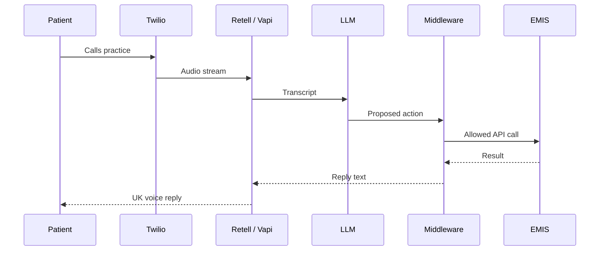
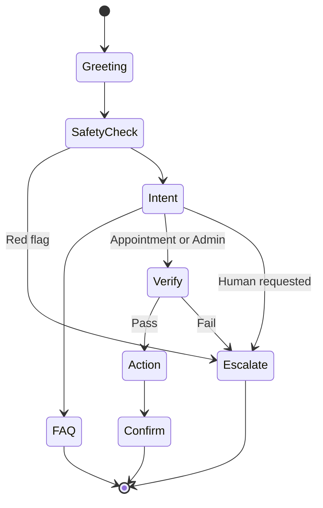

# Architecture: AI Voice Agent for NHS GP Practices

2026 to 2027 | [Back to README](../README.md)

## Call Pipeline



## Who Decides What

| Component | Decides | Never decides |
|---|---|---|
| LLM | Intent, reply wording | Permissions, verification |
| Middleware | Safety rules, allowed actions | Conversation wording |
| EMIS | Patient and appointment data | Anything outside approved scopes |
| Staff | Clinical and edge-case calls | Not applicable |

## Call State Machine



## Tools

| Tool | Verification | Writes data |
|---|---|---|
| `get_practice_info` | No | No |
| `find_patient` | Partial | No |
| `get_available_slots` | Yes | No |
| `book_appointment` | Yes, plus confirmation | Yes, idempotent |
| `cancel_appointment` | Yes, plus confirmation | Yes, idempotent |
| `create_admin_task` | Yes | Yes |
| `transfer_call` | No | No |

Write actions are **idempotent**, so a retry can never create a double booking.

## Per-Practice Config

```yaml
practice_id: practice-a
opening_hours: { mon-fri: "08:00-18:30" }
appointment_types: [gp_routine, nurse, phone_consult]
booking_rules: { max_days_ahead: 14 }
escalation: { reception: "+44...", out_of_hours: nhs_111_message }
voice: { provider: elevenlabs, accent: en-GB }
emis: { gateway: asteroid }
```

## Latency Budget

| Stage | Target |
|---|---|
| End of speech | About 200 to 300 ms |
| Speech to text | About 100 to 200 ms |
| LLM first token | About 300 to 500 ms |
| Text to speech first audio | About 150 to 250 ms |
| **Total** | **About 1.0 to 1.5 s** |

## Safe Fallbacks

| Failure | Fallback |
|---|---|
| EMIS or API down | Callback request and staff task |
| LLM or voice failure | Direct transfer to reception |
| Multiple patient matches | Human transfer |
| Unclear speech | Ask again, then escalate |
| Out of hours | NHS 111 message |
